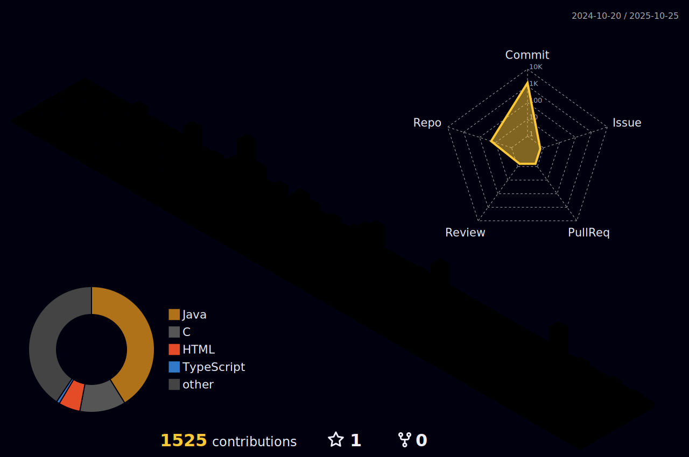

<div align="center"> 
  
|[](https://www.linkedin.com/in/albert-backend-java-spring-boot/) | [](https://www.instagram.com) |  [](mailto:albertinesilva.17@gmail.com) | [](https://stackshare.io/20191tadssaj0026/my-stack) | [](https://github.com/Albertinesilva/livros-indicacao)
|---|---|---|---|---|

</div>                 


<div align="center">
    
</div>

[](https://git.io/typing-svg)

<div align="center">
  <a href="https://github.com/Albertinesilva">
   
  
  </a>
  <!--  -->
</div>

[](https://github.com/ashutosh00710/github-readme-activity-graph)

<p align="center">
  
  <p align="center"></p> 
</p>

---
## Main skills: 

&nbsp;
&nbsp;
&nbsp;
&nbsp;
&nbsp;
&nbsp;

## Tools:

&nbsp;
&nbsp;
&nbsp;
&nbsp;
&nbsp;
&nbsp;


## Other Knowledge:

&nbsp;
&nbsp;
&nbsp;

## Studying in this moment:

&nbsp;
&nbsp;
&nbsp;
&nbsp;
&nbsp;

---

<div align="center">
  
</div>

:octocat: 

---

<p align="center">
  
  &nbsp;&nbsp;
  
  &nbsp;&nbsp;
  
</p>

:octocat:

---

<!--  -->


:octocat: 

---

<!--   profile-green-animate -->



:octocat:

---

<!-- dark snake -->


:octocat: 

---

<p align="center">
<picture>
  <source media="(prefers-color-scheme: dark)" srcset="https://user-images.githubusercontent.com/19292210/199123129-b9c2437d-4e6d-4f1c-a7ea-d9a91babb41d.gif">
  <source media="(prefers-color-scheme: light)" srcset="https://user-images.githubusercontent.com/19292210/88347096-c067a980-ccfe-11ea-8a06-bdaf552fee06.gif">
  
</picture>

:octocat:

---


:octocat: 

---


:octocat: 

---

<!-- Brazil - My Home-->

```geojson
{
  "type": "FeatureCollection",
  "features": [
    {
      "type": "Feature",
      "id": 1,
      "properties": {
        "ID": 0
      },
      "geometry": {
        "type": "Polygon",
        "coordinates": [
          [
            [-73.99, 5.27],  
            [-34.73, -33.77]  
          ]
        ]
      }
    }
  ]
}

```
:octocat: 

---


> _"Enquanto você estiver com vontade de correr atrás dos seus sonhos... ninguém poderá te parar."_ 🔥  
> — 🗡️**Naruto Uzumaki** 
<br>

---

<div align="center">
  <br><p align="centre"><b>   Visitors Count</b></p>  
  <p align="center"></p> 
</div>

<!--
counting of visitors to this page in this section started from May 8, 2025
<a href="http://s01.flagcounter.com/more/ap7">
  
</a>-->

<!-- <a href="http://s01.flagcounter.com/more/ap7">
  
</a> -->


